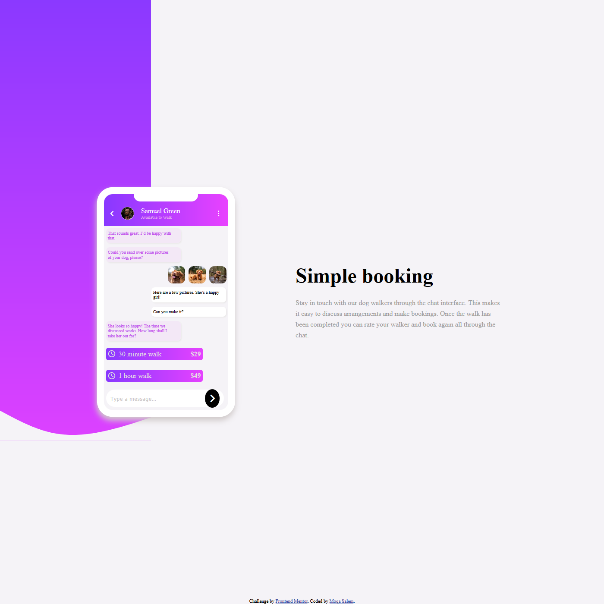
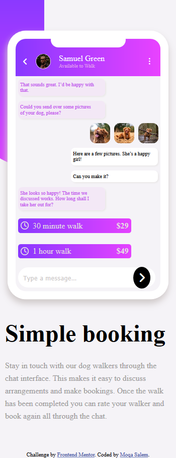

# Frontend Mentor - Chat app CSS illustration solution

This is a solution to the [Chat app CSS illustration challenge on Frontend Mentor](https://www.frontendmentor.io/challenges/chat-app-css-illustration-O5auMkFqY). Frontend Mentor challenges help you improve your coding skills by building realistic projects. 

## Table of contents

- [Overview](#overview)
  - [The challenge](#the-challenge)
  - [Screenshot](#screenshot)
  - [Links](#links)
- [My process](#my-process)
  - [Built with](#built-with)
  - [What I learned](#what-i-learned)
  - [Continued development](#continued-development)
  - [Useful resources](#useful-resources)
- [Author](#author)
- [Acknowledgments](#acknowledgments)

**Note: Delete this note and update the table of contents based on what sections you keep.**

## Overview

### The challenge

Users should be able to:

- View the optimal layout for the component depending on their device's screen size
- **Bonus**: See the chat interface animate on the initial load

### Screenshot

Desktop-design

Mobile-design

### Links

- Solution URL: [solution](https://github.com/moqasalem/chat-app-css-illustration-master)
- Live Site URL: [live](https://moqasalem.github.io/chat-app-css-illustration-master/)

## My process

### Built with

- Semantic HTML5 markup
- CSS custom properties

### Useful resources

- [mozilla ](https://developer.mozilla.org/en-US/docs/Web/CSS) 
- [w3schools](w3schools.com) 

## Author

- Website - [salem moqa](https://github.com/moqasalem)